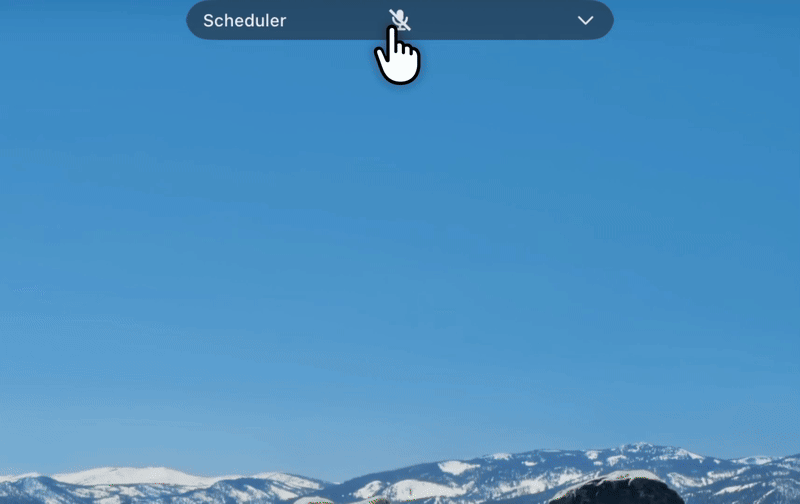

# AutoMeet

AI meeting scheduler for macOS — turns conversation into calendar events.

## Demo

<p align="center">
  
</p>

*A quick demonstration of the app in action - real-time transcription, intent detection, and automatic calendar event creation.*

---

## Features

- **Smart Meeting Scheduling** - Finds available time slots across participants' calendars and coordinates meetings across different time zones
- **Real-time Audio Transcription** - Uses ElevenLabs Scribe v2 for high-quality speech-to-text
- **AI-Powered Intent Detection** - Leverages LLM to detect meeting scheduling intents
- **Automatic Calendar Integration** - Google Calendar

## System Requirements

- **macOS 13.0 (Ventura)** or later
- Node.js 18+
- Xcode Command Line Tools (needed to build the native module)

## Quick start

```bash
xcode-select --install
npm install
npm run dev
```

## Configuration

Open the app → **Settings** and fill in:

- **ElevenLabs API key** (required)
- **OpenAI API key** (required)
- **Google Calendar**: OAuth Client ID/Secret (Desktop app) with redirect URI `http://localhost`

### Google Calendar Setup

1. Visit [Google Cloud Console](https://console.cloud.google.com/)
2. Create or select a project
3. Enable **Google Calendar API**
4. Create OAuth 2.0 credentials:
   - Application type: **Desktop app**
   - Redirect URI: `http://localhost`
5. Copy **Client ID** and **Client Secret**
6. Enter them in the app Settings

### Team calendar sharing (for free/busy finding)

For **Smart Meeting Scheduling** to work, participants' calendars must be visible to your Google account:

- **Google Calendar**: In Google Calendar, share your calendar with the account used in the app (or ensure the app's account has access to "See all event details" on team/participant calendars). Participants need to share their calendars with you so the app can suggest times when everyone is free.
- If calendars are not shared, the app can still create events but cannot suggest slots based on others' availability.

## Usage

### First Time Setup

1. **Launch the app**: `npm run dev` (or run the built app)
2. **Grant permissions**:
   - Microphone access (required for audio capture)
   - Screen recording access (required for system audio capture on macOS)
3. **Configure API keys** via Settings
4. **Connect calendar**:
   - Click "Connect Google Account" and authorize

### Using the App

1. **Start Listening**: Click the "Start Listening" button
2. **Speak naturally**: The app will transcribe your conversation
3. **Automatic detection**: When a meeting intent is detected:
   - The app extracts meeting details (participants, time, topic)
   - Creates a calendar event automatically
4. **View results**: Check the Meeting Panel for created events

### Example Phrases

The app detects phrases like:
- "Let's schedule a meeting with John tomorrow at 3pm"
- "Can we set up a call with Sarah and Mike next week?"
- "I need to meet with the team on Friday afternoon"

## Development

```bash
# dev
npm run dev

# build
npm run build

# package (macOS)
npm run dist:mac
```

## Troubleshooting

- **Microphone permission**: System Settings → Privacy & Security → Microphone
- **System audio capture**: System Settings → Privacy & Security → Screen Recording
- **Google auth fails**: ensure Google Calendar API is enabled and `http://localhost` is an authorized redirect URI
- **Native build fails**:

```bash
cd native
rm -rf build node_modules
npm install
npm run install
```

## License

MIT
